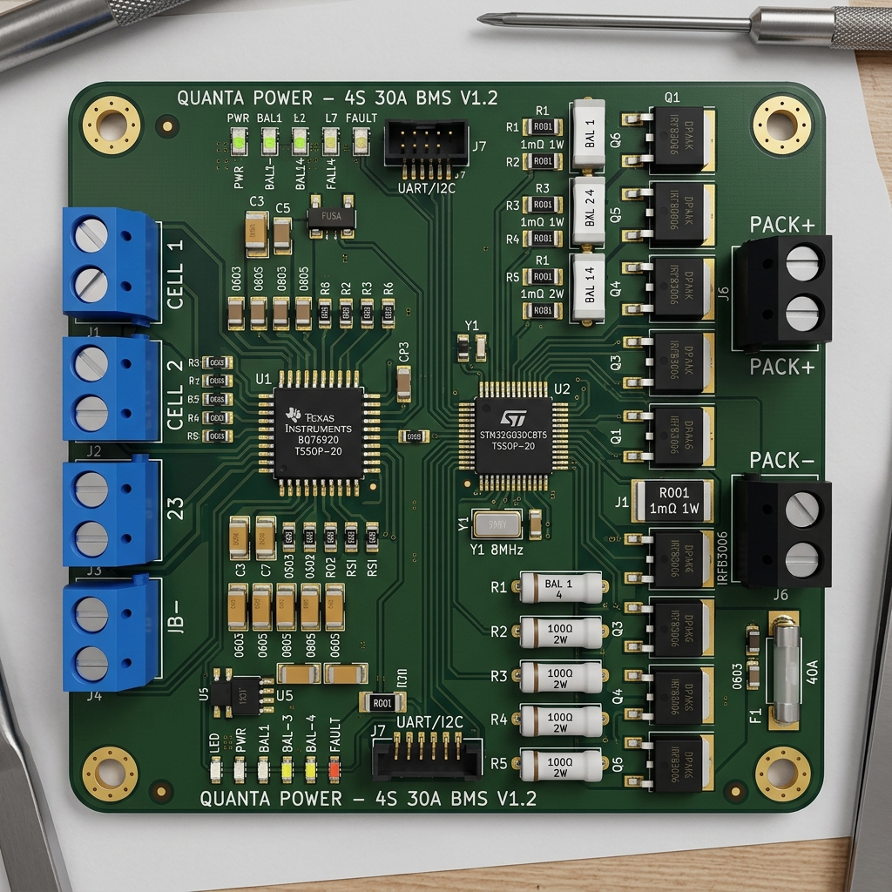
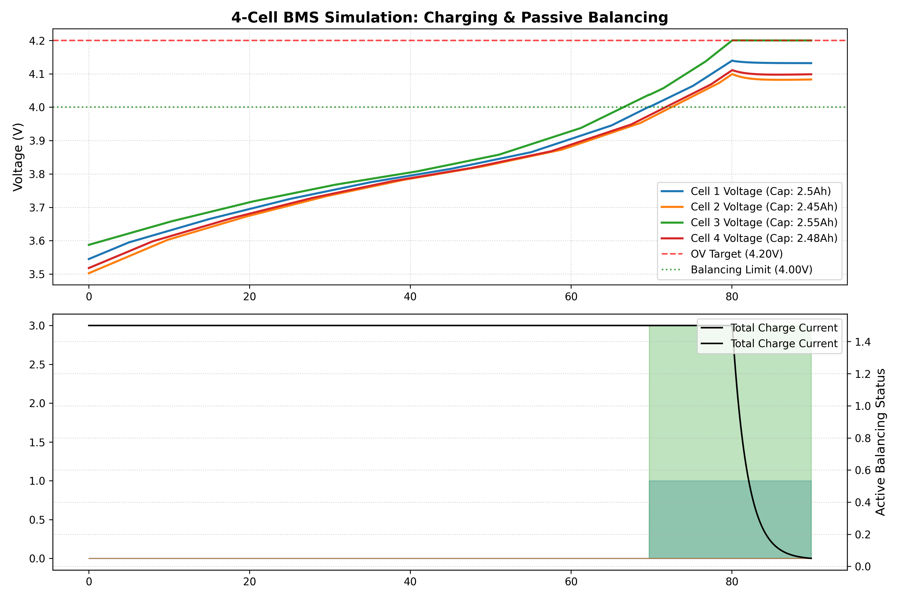

# 🔋 4-Cell Battery Management System (BMS)

This repository features a complete, production-grade **4-Cell Battery Management System (BMS)** design utilizing the **Texas Instruments BQ76920** Analog Front End (AFE) and an **STM32** microcontroller. It is designed to safely monitor, balance, and protect 4-series (4S) Lithium-Ion or Lithium Iron Phosphate (LiFePO4) battery packs.

---

## 📸 Project Visuals & Simulation

### 1. 3D Board Layout & CAD Model
The hardware layout is optimized for low-noise kelvin current sensing and thermal dissipation. It includes input RC filter stages for each cell, back-to-back low-side N-channel protection MOSFETs, and I2C pull-ups.



### 2. CC/CV Charge & Passive Balancing Simulation
Below is the telemetry graph from our Python physical simulation. It models a **1.5A CC/CV charge cycle** of 4 mismatched cells. The bottom subplot shows passive cell balancing in action—shunting current away from the highest cell (Cell 3) when it exceeds 4.00V to allow the lower cells to catch up, successfully preventing overvoltage cutoffs.



---

## 🛠️ Repository Structure

*   📁 **`bms_pcb/`**: KiCad v6 CAD files containing the project metadata, schematics ([`bms_sch`](bms_pcb/bms_pcb.kicad_sch)), layout routing ([`bms_pcb`](bms_pcb/bms_pcb.kicad_pcb)), and a programmatic generator script.
*   📁 **`firmware/`**: Clean, modular C driver code for the STM32G030 microcontroller:
    *   [`bq76920.c`](firmware/Core/Src/bq76920.c) / [`.h`](firmware/Core/Inc/bq76920.h): AFE driver managing I2C transactions, CRC-8 validation, calibration, and cell bypasses.
    *   [`main.c`](firmware/Core/Src/main.c): Real-time scheduler polling telemetry every 250ms and evaluating balancing rules every 5s.
*   📁 **`simulation/`**: Python model ([`simulate_bms.py`](simulation/simulate_bms.py)) and telemetry outputs ([`cell_voltages.xlsx`](simulation/cell_voltages.xlsx), [`cell_voltages.csv`](simulation/cell_voltages.csv)).
*   📁 **`docs/`**: Electrical safety calculations ([`safety_design.md`](docs/safety_design.md)) and Mermaid flowcharts ([`flowcharts.md`](docs/flowcharts.md)).

---

## ⚡ Key Engineering & Safety Features

### 1. Robust I2C with CRC-8 (PEC)
To ensure reliable operation in noisy high-current switching environments, every single I2C read and write is protected by an 8-bit Packet Error Check (PEC) utilizing the CCITT polynomial $x^8 + x^2 + x^1 + 1$ (0x07). A single byte read checks the complete frame:
`[Write Address -> Register Address -> Read Address -> Data]`

### 2. Safety Protection Settings (Hardware Comparator Level)
Thresholds are set in hardware registers, ensuring protection FETs open instantly without waiting for MCU intervention:
*   **Cell Overvoltage (OV)**: **4.22V** ($1.0\text{s}$ delay) to prevent gas generation and plating.
*   **Cell Undervoltage (UV)**: **2.80V** ($1.0\text{s}$ delay) to protect cell health.
*   **Overcurrent in Discharge (OCD)**: **22A** ($320\text{ms}$ delay) continuous protection.
*   **Short-Circuit in Discharge (SCD)**: **89A** ($200\mu\text{s}$ delay) to prevent thermal runaway of the switches.

### 3. Waking from SHIP Mode
The BQ76920 starts in low-power SHIP mode ($<1\mu\text{A}$). The firmware implements the start-up sequence by issuing a **3ms GPIO pulse** to the TS1 pin, booting the AFE LDO to power the STM32, and then loading configurations.

---

## ⚖️ Cell Balancing Control Logic

Passive cell balancing is managed dynamically by the host MCU:
1. Telemetry scans are performed every 250ms.
2. Balancing is evaluated every 5 seconds.
3. If **any cell voltage > 4.00V** and **$\Delta V_{cell} > 20\text{mV}$**, the balancing FET for the highest cell is engaged.
4. Cell bypass is restricted to one cell at a time to prevent thermal load on the internal silicon of the AFE.

---

## ⚙️ How to Run locally

### 1. Compile the Firmware
You can compile the STM32 project using the standard GNU Arm Embedded Toolchain:
```bash
cd firmware
make
```

### 2. Run the Simulation
Execute the charging and balancing model using Python:
```bash
pip install numpy pandas matplotlib openpyxl
python simulation/simulate_bms.py
```
This updates the Excel spreadsheet (`cell_voltages.xlsx`) and regenerates the plot (`cell_voltages.png`).
