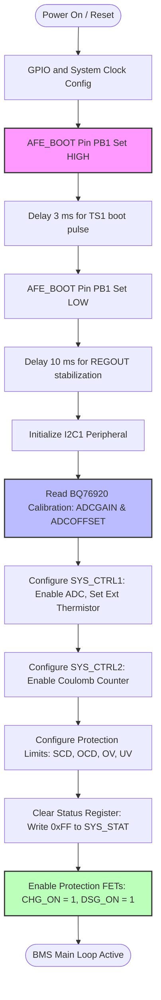
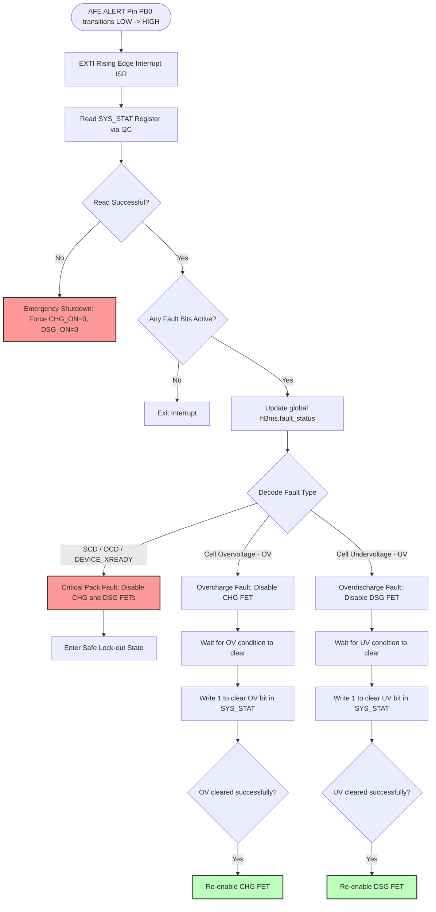
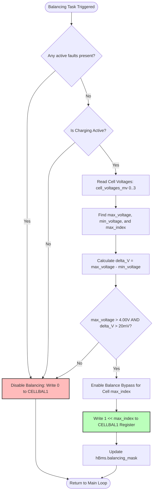

# 4-Cell BMS Operational Flowcharts

This document provides visual flowcharts of the core firmware logic, represented in Mermaid syntax.

---

## 1. System Boot and AFE Initialization Sequence

This flowchart shows how the STM32 controller wakes up the BQ76920 AFE, reads the factory calibration coefficients, and enables the system protection circuits.

---

## 2. ALERT Interrupt and Fault Handling Routine

The BQ76920 drives the ALERT pin high when it detects a hardware fault. This triggers an EXTI interrupt on the STM32 to protect the battery pack immediately.

---

## 3. Passive Cell Balancing State Machine

This algorithm runs in the main loop every 5 seconds. It determines if cell balancing is required and selects the target cell to bypass charge current.

